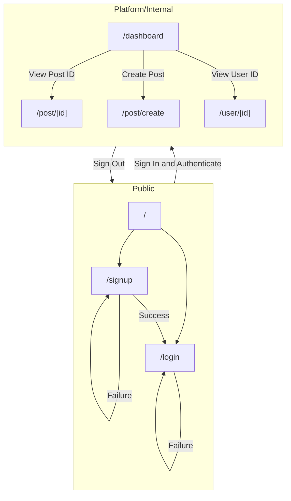

```mermaid
graph TD
    LandingPage["/"]
    LoginPage["/login"]
    SignupPage["/signup"]
    DashboardPage["/dashboard"]
    CreatePostPage["/post/create"]
    PostPage["/post/[id]"]
    UserPage["/user/[id]"]

    subgraph Public
        direction TB
        LandingPage --> LoginPage
        LandingPage --> SignupPage
        SignupPage -->|Failure| SignupPage
        LoginPage -->|Failure| LoginPage
        SignupPage -->|Success| LoginPage
    end

    subgraph Platform/Internal
        direction TB
        DashboardPage -->|View Post ID| PostPage
        DashboardPage -->|Create Post| CreatePostPage
        DashboardPage -->|View User ID| UserPage
    end

    Platform/Internal -->|Sign Out|Public

    Public -->|Sign In and Authenticate|Platform/Internal

    
```