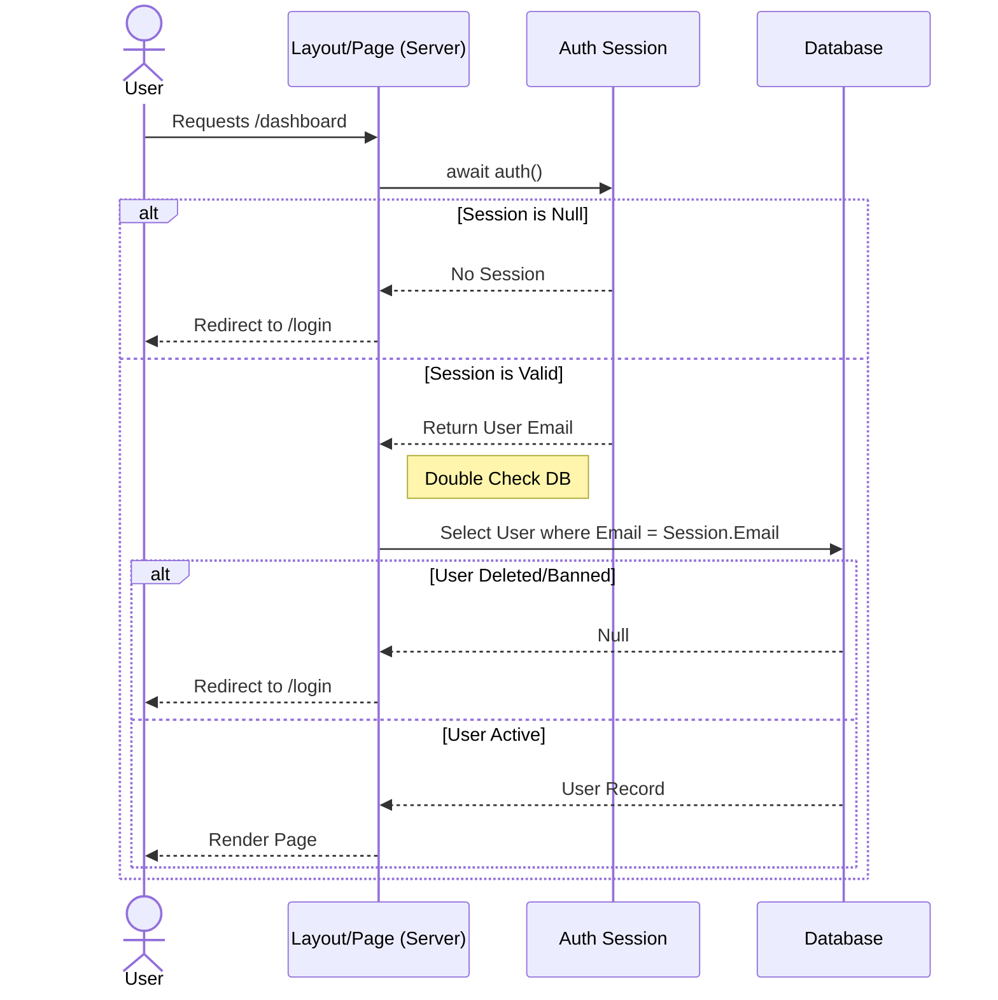

```mermaid
sequenceDiagram
    actor User
    participant Middleware as Layout/Page (Server)
    participant Auth as Auth Session
    participant DB as Database

    User->>Middleware: Requests /dashboard
    
    Middleware->>Auth: await auth()
    
    alt Session is Null
        Auth-->>Middleware: No Session
        Middleware-->>User: Redirect to /login
    else Session is Valid
        Auth-->>Middleware: Return User Email
        
        note right of Middleware: Double Check DB
        Middleware->>DB: Select User where Email = Session.Email
        
        alt User Deleted/Banned
            DB-->>Middleware: Null
            Middleware-->>User: Redirect to /login
        else User Active
            DB-->>Middleware: User Record
            Middleware-->>User: Render Page
        end
    end
```