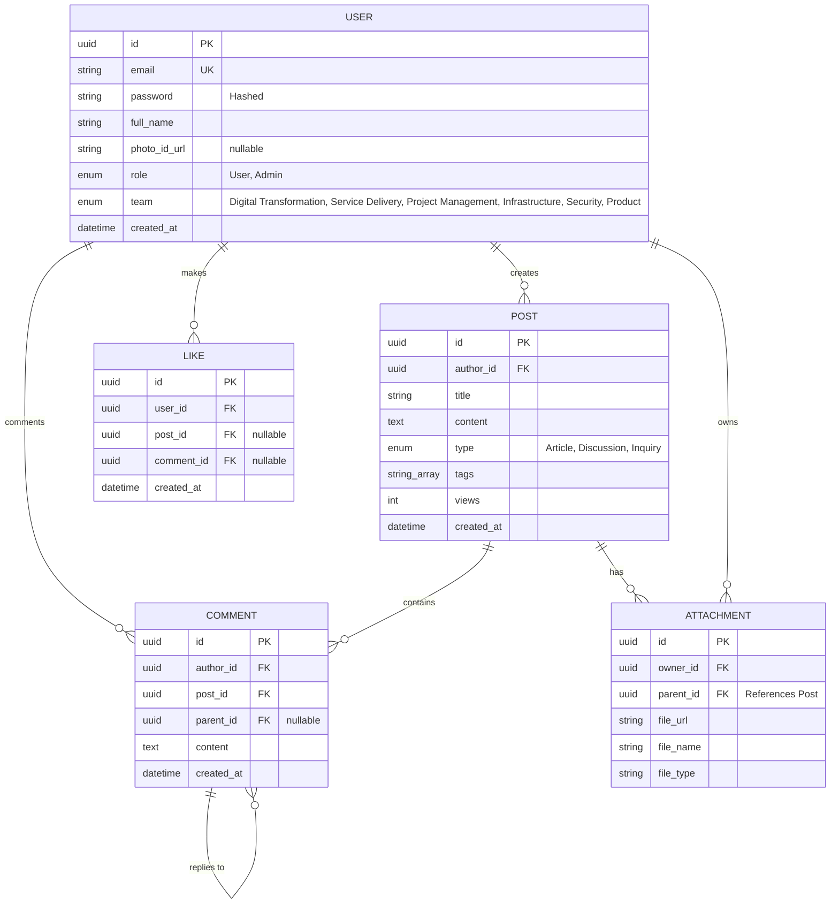

```mermaid
erDiagram
    USER ||--o{ POST : "creates"
    USER ||--o{ COMMENT : "comments"
    USER ||--o{ LIKE : "makes"
    
    POST ||--o{ COMMENT : "contains"
    POST ||--o{ ATTACHMENT : "has"
    USER ||--o{ ATTACHMENT : "owns"
    
    COMMENT ||--o{ COMMENT : "replies to"
    
    USER {
        uuid id PK
        string email UK
        string password "Hashed"
        string full_name
        string photo_id_url "nullable"
        enum role "User, Admin"
        enum team "Digital Transformation, Service Delivery, Project Management, Infrastructure, Security, Product"
        datetime created_at
    }

    POST {
        uuid id PK
        uuid author_id FK
        string title
        text content
        enum type "Article, Discussion, Inquiry"
        string_array tags
        int views
        datetime created_at
    }

    COMMENT {
        uuid id PK
        uuid author_id FK
        uuid post_id FK
        uuid parent_id FK "nullable"
        text content
        datetime created_at
    }

    LIKE {
        uuid id PK
        uuid user_id FK
        uuid post_id FK "nullable"
        uuid comment_id FK "nullable"
        datetime created_at
    }

    ATTACHMENT {
        uuid id PK
        uuid owner_id FK
        uuid parent_id FK "References Post"
        string file_url
        string file_name
        string file_type
    }
```