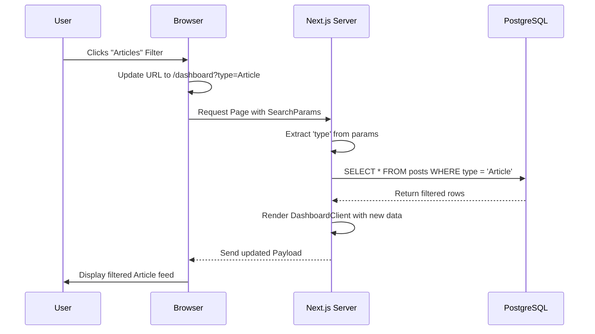

```mermaid
sequenceDiagram
    participant User
    participant Browser
    participant Server as Next.js Server
    participant DB as PostgreSQL

    User->>Browser: Clicks "Articles" Filter
    Browser->>Browser: Update URL to /dashboard?type=Article
    Browser->>Server: Request Page with SearchParams
    Server->>Server: Extract 'type' from params
    Server->>DB: SELECT * FROM posts WHERE type = 'Article'
    DB-->>Server: Return filtered rows
    Server->>Server: Render DashboardClient with new data
    Server-->>Browser: Send updated Payload
    Browser->>User: Display filtered Article feed
```