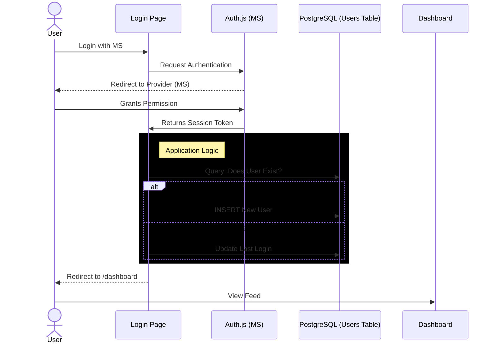

```mermaid
sequenceDiagram
    actor User
    participant UI as Login Page
    participant Auth as Auth.js (MS)
    participant DB as PostgreSQL (Users Table)
    participant Dash as Dashboard

    User->>UI: Login with MS
    UI->>Auth: Request Authentication
    Auth-->>User: Redirect to Provider (MS)
    User->>Auth: Grants Permission
    Auth->>UI: Returns Session Token
    
    rect rgb(0, 0, 0)
        note right of UI: Application Logic
        UI->>DB: Query: Does User Exist?
        alt User Not Found
            UI->>DB: INSERT New User
        else User Exists
            UI->>DB: Update Last Login
        end
    end

    UI-->>User: Redirect to /dashboard
    User->>Dash: View Feed
```