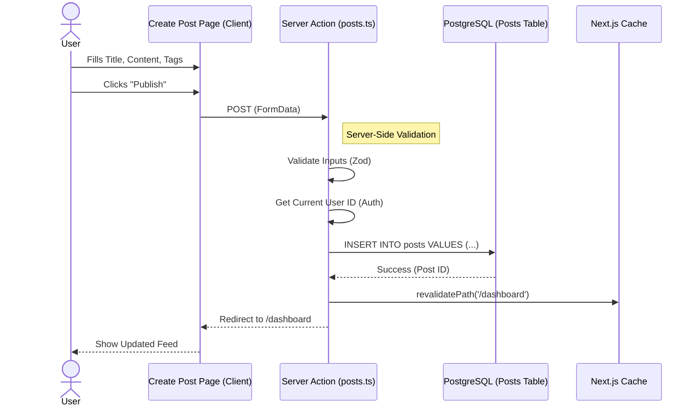

```mermaid
sequenceDiagram
    actor User
    participant Form as Create Post Page (Client)
    participant Server as Server Action (posts.ts)
    participant DB as PostgreSQL (Posts Table)
    participant Cache as Next.js Cache

    User->>Form: Fills Title, Content, Tags
    User->>Form: Clicks "Publish"
    
    Form->>Server: POST (FormData)
    
    note right of Server: Server-Side Validation
    Server->>Server: Validate Inputs (Zod)
    Server->>Server: Get Current User ID (Auth)
    
    Server->>DB: INSERT INTO posts VALUES (...)
    DB-->>Server: Success (Post ID)
    
    Server->>Cache: revalidatePath('/dashboard')
    Server-->>Form: Redirect to /dashboard
    
    Form-->>User: Show Updated Feed
```