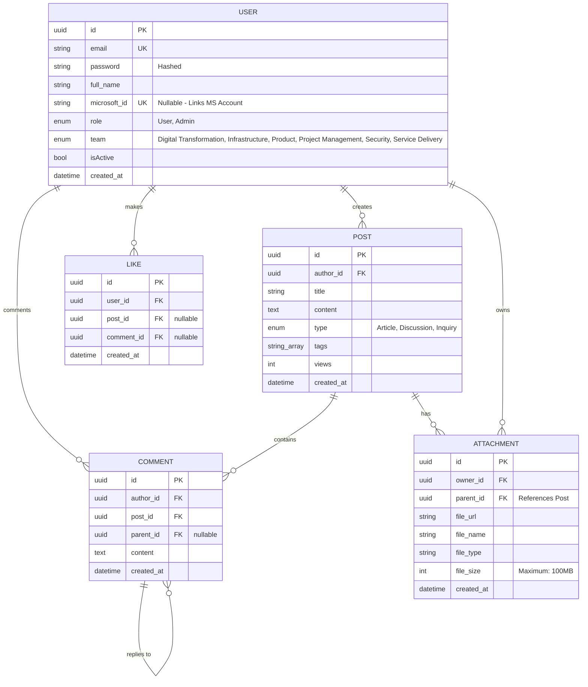

# System Architecture & Schema Relations Manual

This document outlines the system architecture, infrastructure topology, data flow lifecycles, and relational database schema constraints for the **SSI Info Hub**. It serves as a technical blueprint for understanding how data moves from a client interaction down to physical table allocations.

---

## 1. High-Level System Architecture & Data Flow

The SSI Info Hub operates as a multi-threaded, reverse-proxied Next.js deployment hosted on a Red Hat Enterprise Linux (RHEL) server. 

### 1.1 Component Topology
The diagram below illustrates how an inbound user request passes through the server boundary and branches out to memory, storage, and database runtimes:

```text
                  [ External Enterprise User Browser ]
                                   │
                                   │ HTTPS / WSS (Port 3000)
                                   ▼
                        [ Nginx Reverse Proxy ]
                                   │
                     ┌─────────────┴─────────────┐
                     │ Proxy Pass                │ Static Build Files
                     ▼ (Port 3001)               ▼
         [ PM2 Next.js Cluster ]       [ MkDocs Static Engine ]
         (Spawns "Max" CPU Workers)    (Documentation Portal - Port 3002)
                     │
         ┌───────────┼───────────────────────────┐
         │           │                           │
         ▼           ▼                           ▼
  [ PostgreSQL ]  [ Microsoft Entra ID ]  [ Physical Volume ]
  (Port 5432)     (SSO OAuth Handshake)   (/mnt/internaltool)
```

### 1.2 The Request-Response Lifecycle

1. **Edge Entry (Nginx)**: Inbound traffic hits Nginx on port 3000. Nginx handles SSL termination, enforces TLS 1.2/1.3 compliance, and validates that payload streams do not exceed 100MB.

2. **Cluster Routing (PM2)**: Traffic is passed internally to port 3001, where PM2 balances requests round-robin across isolated Node.js application workers running Next.js in cluster mode.

3. **Data Fetching & Storage**:

    - Standard interface requests initiate short-lived, lazy-loaded database queries via Drizzle ORM to PostgreSQL on port 5432.

    - File uploads or media stream inquiries bypass standard JSON states to execute a direct file system streaming loop targeting the `/mnt/internaltool` attachment volume.

---

## 2. Relational Database Schema & Drizzle Mapping

The backend database topology relies on Drizzle ORM communicating via a lazy-loaded, single-connection `postgres.js` client wrapper (`src/db/index.ts`). The database connection establishes a strict 10-second handshake timeout to eliminate hanging processes.

The application manages 5 core operational entities. Their relational interdependencies are structured as follows:



---

## 3. Cascading Rules & Data Integrity Constraints
To prevent dead rows or orphaned blocks from leaking performance across the RHEL ecosystem, the database enforces tight foreign key cascading and physical disk unlinking behaviors.

### 3.1 Relational Cascaldes
All structural relationships inside schema.ts use explicit cascade delete rules:

* When a `user` record is expunged from the database, all associated records in `posts`, `comments`, and `likes` matching their `author_id`, `user_id`, or `owner_id` are automatically deleted.

* When a `post` is deleted, its downstream child entries inside `comments`, `attachments`, and `likes` are removed instantly at the database level.

* When a `comment` is deleted, `likes` with `comment_id` pointing to the `comment` are also removed.

### 3.2 Physical Disk Synchronization Guardrail
Database drops do not naturally speak to the RHEL storage system. To prevent the storage partition from packing out with unreferenced media assets, the server action framework inside `attachments.ts` binds record drops directly to physical filesystem unlinking:

```plaintext
[ Admin issues deleteAttachment() ]
                │
                ▼
  [ Fetch record from attachments table ]
                │
                ▼
  [ Unlink file path via fs.unlink() ] ──► Removes physical file from /mnt/internaltool
                │
                ▼
  [ Delete record from attachments table ] ──► Removes metadata row from PostgreSQL
```

If `fs.unlink()` fails because a file was manually modified or is missing from disk, a warn log is passed to standard error, and the database record is safely cleared to maintain application integrity.

---

## 4. Application Security Boundaries & Access Control (RBAC)
Authentication checks are applied universally across both API endpoints and background system operations.

### 4.1 Token Verification & Domain Guarding
When a user logs in via Microsoft Entra ID, NextAuth validates the identity assertion. Every subsequent API check or page call evaluates two defensive parameters:

1. The Session Scope: The user token must match an active session signature signed by the application's unique `AUTH_SECRET`.

2. The Domain Firewall: The routing interface in `route.ts` parses the identity payload and blocks any transaction where the user's email domain fails to match `@ssiph.com`, returning an HTTP 403 Forbidden error.

### 4.2 Role-Based Action Validation (RBAC)
Server actions enforce hard administrative checkpoints before performing operations. For example, during a file deletion request:

* The system evaluates the caller's role string inside the `users` table.

* If the user's role is flagged as `Admin`, the transaction proceeds immediately.

* If the user is a standard `User`, the engine compares the token identity against the target asset's `owner_id`. If they do not match, the action triggers an unauthorized exception, blocking the transaction.

---

## 5. Migration Lifecycle & Schema Evolution
Database updates are tracked deterministically using Drizzle's migration journal framework.

### 5.1 Modifying System Structure
When a developer modifies a data type or adds a column within `src/db/schema.ts`, they must execute the following commands inside the repository environment to update the database:

```bash
# 1. Compare codebase schema.ts against live DB and generate SQL migration log
npx drizzle-kit generate

# 2. Apply pending SQL migrations safely to the target environment database
npx drizzle-kit push
```

### 5.2 Migration History Journals
All historical schema changes are saved into tracking logs located under the root project directory:
`/root/ssi-info-hub/info-hub/drizzle/meta/`

These snapshots must be committed to your version control repository to ensure staging and production systems maintain a uniform database structure.

!!! info
    For more information regarding system architecure, you may refer to the documents and mermaid diagrams found under `/root/ssi-info-hub/docs`