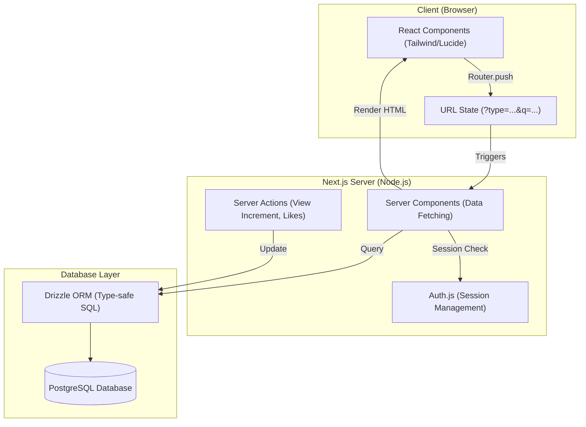

```mermaid
graph TD
    subgraph Client_Browser ["Client (Browser)"]
        UI["React Components (Tailwind/Lucide)"]
        State["URL State (?type=...&q=...)"]
    end

    subgraph NextJS_Server ["Next.js Server (Node.js)"]
        Auth["Auth.js (Session Management)"]
        Page["Server Components (Data Fetching)"]
        Actions["Server Actions (View Increment, Likes)"]
    end

    subgraph Database_Layer ["Database Layer"]
        Drizzle["Drizzle ORM (Type-safe SQL)"]
        Postgres[(PostgreSQL Database)]
    end

    UI -->|Router.push| State
    State -->|Triggers| Page
    Page -->|Session Check| Auth
    Page -->|Query| Drizzle
    Actions -->|Update| Drizzle
    Drizzle --> Postgres
    Page -->|Render HTML| UI
```