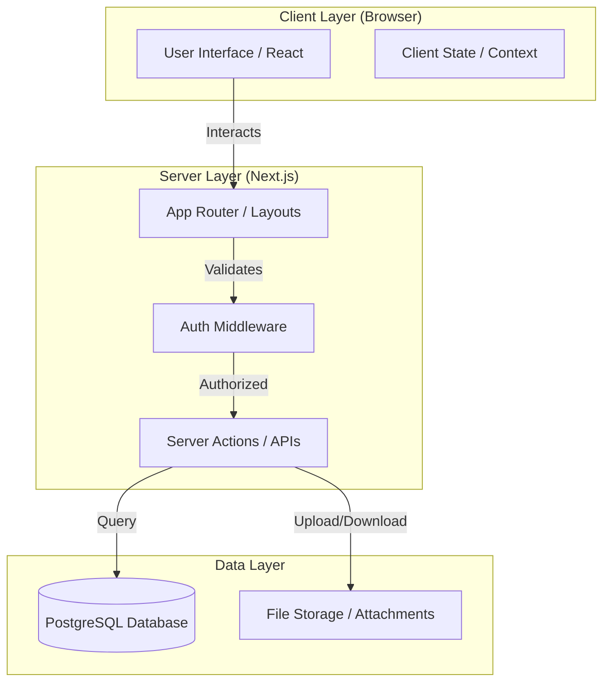

```mermaid
graph TD
    subgraph Client ["Client Layer (Browser)"]
        UI[User Interface / React]
        Store[Client State / Context]
    end

    subgraph Server ["Server Layer (Next.js)"]
        Router[App Router / Layouts]
        Auth[Auth Middleware]
        API[Server Actions / APIs]
    end

    subgraph Data ["Data Layer"]
        DB[(PostgreSQL Database)]
        Blob[File Storage / Attachments]
    end

    UI -->|Interacts| Router
    Router -->|Validates| Auth
    Auth -->|Authorized| API
    API -->|Query| DB
    API -->|Upload/Download| Blob
```