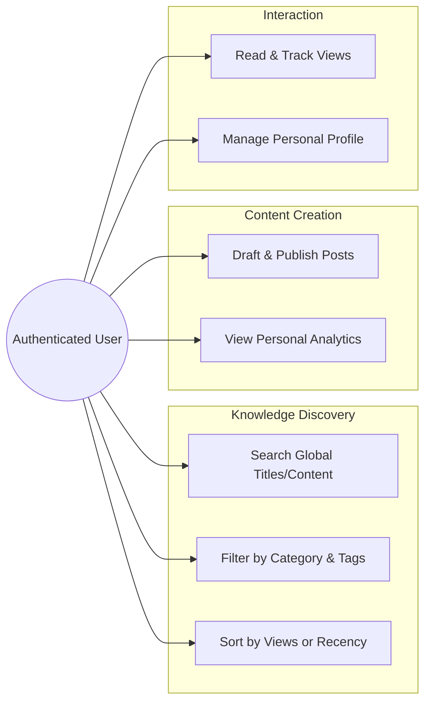

```mermaid
graph LR
    User((Authenticated User))

    subgraph "Knowledge Discovery"
        UC1[Search Global Titles/Content]
        UC2[Filter by Category & Tags]
        UC3[Sort by Views or Recency]
    end

    subgraph "Content Creation"
        UC4[Draft & Publish Posts]
        UC5[View Personal Analytics]
    end

    subgraph "Interaction"
        UC6[Read & Track Views]
        UC7[Manage Personal Profile]
    end

    User --> UC1
    User --> UC2
    User --> UC3
    User --> UC4
    User --> UC5
    User --> UC6
    User --> UC7
```